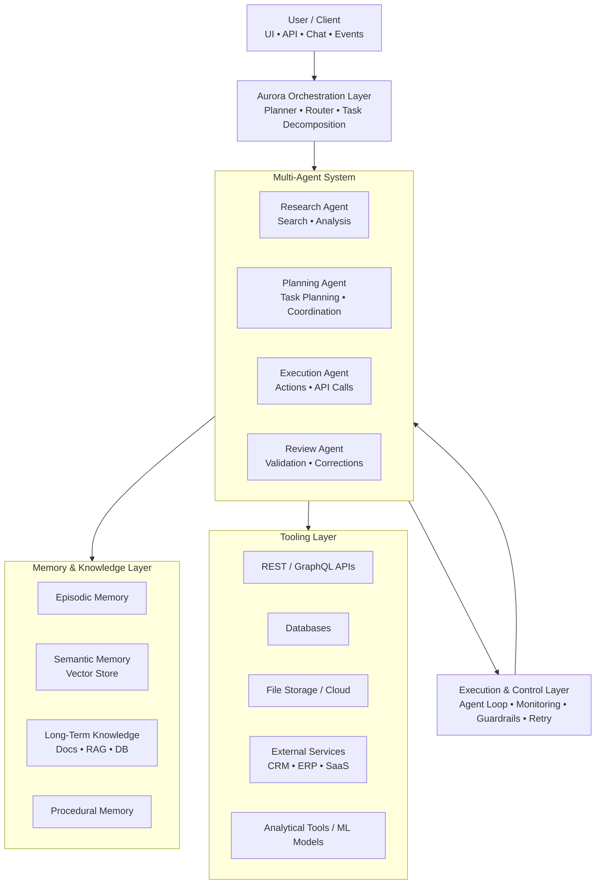

# **Aurora Agentic AI — Typical Architecture Overview**

**Aurora** follows the same **architectural patterns** used in modern agentic AI platforms. Below is a breakdown of the core components and how they work together.

---

## **1) Agent Core**
The Agent Core defines the fundamental characteristics and capabilities of each agent:

- role, personality, and competencies  
- access to tools and external systems  
- operational context  
- memory (short‑term and long‑term)

This layer determines *what the agent is* and *what it can do*.

---

## **2) Planner / Orchestrator**
The Planner (or Orchestrator) coordinates the entire system:

- decomposes tasks into actionable steps  
- selects the appropriate agent for each step  
- manages workflow and execution order  
- decides when an agent should act autonomously vs. when it should ask the user for confirmation  

This is the “brain” of the multi‑agent system.

---

## **3) Tooling Layer**
Agents can use a wide range of tools to interact with the outside world:

- REST APIs  
- databases  
- file systems  
- analytical tools  
- machine learning models  
- internal enterprise services  

This layer enables agents to perform real operations, not just generate text.

---

## **4) Memory Layer**
Aurora uses multiple types of memory to support reasoning and continuity:

- **episodic memory** — what the agent has done  
- **semantic memory** — embeddings and vectorized knowledge  
- **long‑term memory** — documents, RAG stores, knowledge bases  
- **procedural memory** — how to perform tasks and workflows  

This allows agents to learn, recall, and adapt over time.

---

## **5) Execution Engine**
The Execution Engine ensures that agents operate reliably and safely:

- agent loop (perceive → plan → act → reflect)  
- monitoring and logging  
- retry logic  
- guardrails and safety checks  
- cost and token management  

This is the runtime environment that keeps the system stable.

---

## **6) Multi‑Agent Collaboration**
Aurora supports rich collaboration patterns between agents:

- agents can communicate with each other  
- hand off tasks  
- negotiate solutions  
- work in parallel  

This enables complex workflows that go beyond the capabilities of a single agent.

---

# **What You Can Build with Aurora Agentic AI**

Below are typical real‑world use cases enabled by this architecture.

---

## **1) Business Process Automation Agent**
An agent that:

- retrieves data  
- analyzes it  
- generates reports  
- sends emails  
- updates systems  

Ideal for back‑office automation.

---

## **2) Data Integration Agent**
An agent that:

- connects to APIs  
- fetches data  
- normalizes and transforms it  
- writes it to a database  

Useful for ETL‑like tasks.

---

## **3) Multi‑Agent Workflow**
A coordinated pipeline such as:

**researcher → planner → executor → reviewer**

Each agent specializes in a different stage of the workflow.

---

## **4) DevOps / MLOps Agent**
An agent that:

- monitors logs  
- detects anomalies  
- restarts services  
- creates tickets  

Great for operational automation.

---

## **5) Customer Support Agent**
An agent that:

- understands context  
- uses memory  
- performs actions (e.g., modify a reservation)  

This enables more human‑like, proactive support experiences.

---
# **Aurora Agentic AI vs. Azure AI Foundry**
**Aurora Agentic AI** is a conceptual architecture for agent systems
 **Azure AI Foundry** is a real Microsoft platform that can fully implement that architecture in practise.

---
# **What is Aurora Agentic AI?**
Aurora Agentic AI is a conceptual architecture — not a product.

It represents:

- a reference model for how a modern agentic AI platform could be structured

- a blueprint describing layers such as planning, memory, tools, execution, and multi‑agent collaboration

- a design pattern for building autonomous AI systems

Aurora is not:

- a SaaS platform

- a downloadable tool

- an Azure service

- an open‑source framework

- a product with a free tier

**It is simply a name for an architectural pattern.**
---

# **What is Azure AI Foundry?**
Azure AI Foundry is a real Microsoft platform for building, orchestrating, deploying, and governing AI applications — including agentic systems.

It provides:

- model hosting (GPT‑4o, Phi‑3, Llama, Mistral, etc.)

- agent orchestration

- memory and vector search

- tool integration

- multi‑agent workflows

Prompt Flow for pipelines

- monitoring, governance, safety

- enterprise‑grade deployment

- Azure AI Foundry is a production environment, not a conceptual model.

It also includes a free tier, which is enough for prototyping and PoC work.

---

# **Can Azure AI Foundry implement the Aurora architecture?**
Yes — and it does it very well.

Azure AI Foundry provides:

- Agent orchestration

- Memory (Vector Search, Azure AI Search)

- Tools (Functions, APIs, Plugins)

- Multi‑agent patterns

- Monitoring, guardrails, governance

- Model catalog

- Prompt Flow

- Evaluation & safety features

In other words, it includes all the components described in the Aurora Agentic AI architecture.

In practice:

Azure AI Foundry is a real, production‑grade implementation of the architecture that Aurora describes conceptually.
---
