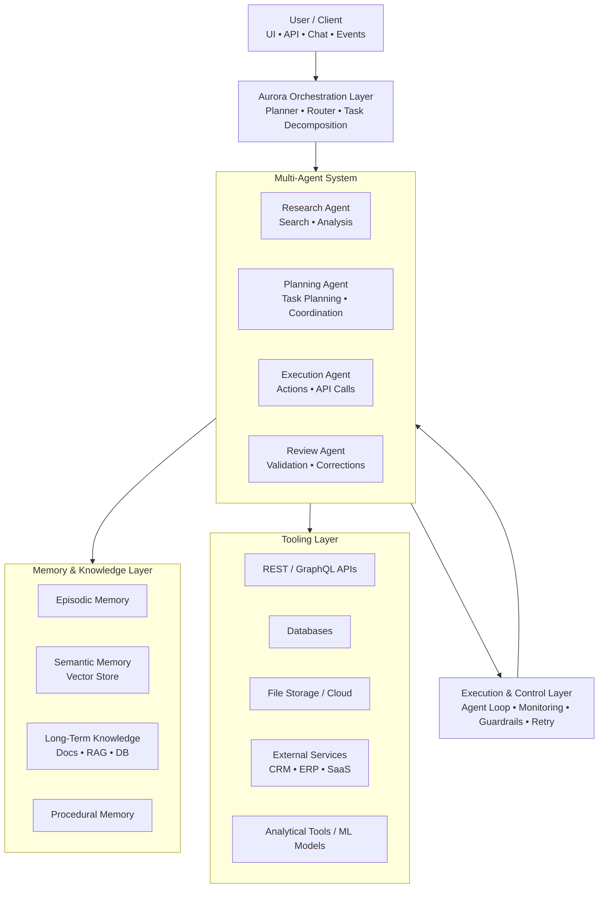

```mermaid
flowchart TD

    U[User / Client<br/>UI • API • Chat • Events]

    O[Aurora Orchestration Layer<br/>Planner • Router • Task Decomposition]

    subgraph MAS[Multi-Agent System]
        R[Research Agent<br/>Search • Analysis]
        P[Planning Agent<br/>Task Planning • Coordination]
        E[Execution Agent<br/>Actions • API Calls]
        V[Review Agent<br/>Validation • Corrections]
    end

    subgraph MEM[Memory & Knowledge Layer]
        EP[Episodic Memory]
        SEM[Semantic Memory<br/>Vector Store]
        LT[Long-Term Knowledge<br/>Docs • RAG • DB]
        PR[Procedural Memory]
    end

    subgraph TOOL[Tooling Layer]
        API[REST / GraphQL APIs]
        DB[Databases]
        FS[File Storage / Cloud]
        EXT[External Services<br/>CRM • ERP • SaaS]
        ML[Analytical Tools / ML Models]
    end

    EX[Execution & Control Layer<br/>Agent Loop • Monitoring • Guardrails • Retry]

    U --> O
    O --> MAS

    MAS --> MEM
    MAS --> TOOL
    MAS --> EX

    EX --> MAS
```
